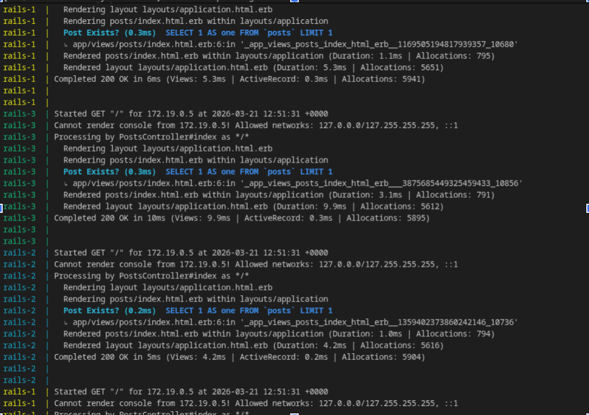
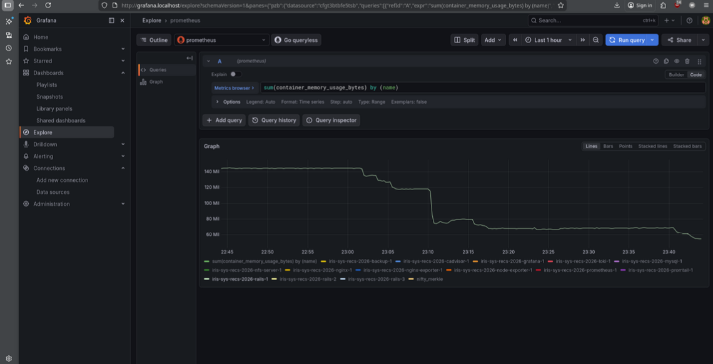
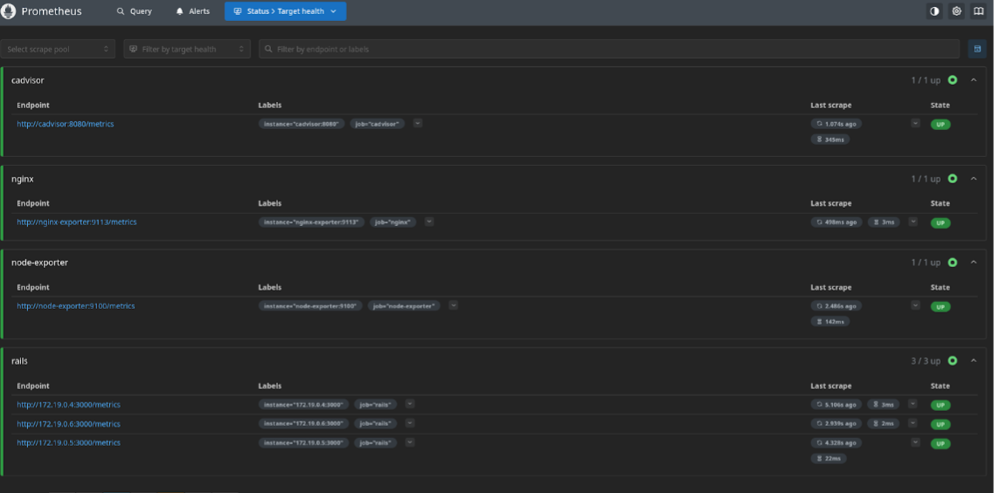

# iris-sys-recs-2026 ROUND 2  
Submission for the **IRIS Systems Team Recruitment 2026**.

# Completed Tasks  

Below are the tasks completed:

---

## Reverse Proxy, Load Balancing & Access Control  

- Configured NGINX to load balance across 3 Rails application replicas  
- Set up upstream blocks with health checks and automatic failover  
- Enabled graceful NGINX reloads without dropping active connections  
- Implemented rate limiting per IP with proper burst handling (returns **429** on limit exceed)  
- Configured subdomain-based routing (e.g., `app.localhost`, `grafana.localhost`)  
- Secured internal services like Grafana using HTTP Basic Authentication at NGINX level  

### Task 1 Visual Proof

---

## Shared Storage via NFS  

- Deployed NFS server container with proper export configuration  
- Mounted shared directory across all 3 Rails replicas  
- Verified cross-replica consistency (file written from one replica accessible from others)  
- Ensured persistence across container restarts  

---

## Monitoring Stack  

- Configured Prometheus to scrape:  
  - Node Exporter (host metrics)  
  - cAdvisor (container metrics)  
  - NGINX metrics  
  - Rails application replicas  
- Set up Grafana dashboards displaying:  
  - CPU & memory usage  
  - Container restarts  
  - Request rate  
  - Error rate  
- Restricted direct port exposure of Prometheus & Grafana (accessible only via NGINX)  

### Task 3 Visual Proof

---

## Automated Backup System  

- Periodically dumps MySQL database  
- Archives NFS shared storage  
- Stores backups with timestamped filenames  
- Implements retention policy to keep the latest **5 backups**

---

## Bonus

- Instrumented application metrics using a Prometheus client library  
- Integrated Loki + Promtail for centralized log aggregation  

### Bonus Visual Proof

---

# Implementation Report

Below is the complete walkthrough of how I built the entire Dockerized architecture, detailing the network proxies, shared storage, monitoring, and backup systems, along with the biggest challenges I successfully resolved along the way.

## 1. Reverse Proxy, Load Balancing & Access Control
To securely manage all incoming traffic and distribute it across the application efficiently, I configured a custom NGINX reverse proxy.
Instead of exposing our app directly, NGINX acts as the only public door into the cluster.

I configured an upstream layer that maps traffic automatically across all 3 Rails replicas using active health checks. If one crashes, NGINX bypasses it instantly.
I also set up strict subdomain routing (app.localhost, grafana.localhost) and enforced global rate limiting (10 requests/sec, returning HTTP 429) to automatically block flood attacks. Finally, I deeply secured the internal dashboards behind an encrypted .htpasswd Basic Auth gate.

**The biggest issue** I faced here was Docker accidentally mounting the raw .htpasswd file as a directory, causing NGINX to completely crash with 500 errors. I fixed this by nesting the password file inside an `auth/` host folder and mounting the entire directory instead. I also explicitly configured NGINX to wipe the HTTP Authorization header manually before proxying traffic backward, because Grafana was accidentally rejecting legitimate admin logins with a 403 Forbidden error!

## 2. Shared Storage via NFS
To guarantee files uploaded by one replica are universally accessible by the others in real-time, I deployed an independent Alpine NFS storage server mapped to a strict static IP (`172.25.0.2`).

I defined a global internal Docker volume using the modern NFSv4 driver and mapped it straight into the `/app/storage` directory of all 3 Rails replicas. Doing this ensures absolute cross-replica consistency and survival across restarts.

**The primary hurdle** here was a brutal Arch Linux system conflict. When Docker tried to natively mount the NFS volume, it forcefully threw "operation not supported" because the host lacked `nfs-utils`. When I tried to install it via pacman, I hit a stubborn `libgcc` dependency block. I securely forced a standard package overwrite to install the utilities, allowing Docker to magically mount the volume. I also strategically paused the boot cycle, ensuring the NFS container starts up 5 seconds before the web layer to eliminate any early-mount race conditions.

## 3. Monitoring Stack & Log Aggregation
To give us total performance visibility without exposing critical ports to the public internet, I built a completely isolated internal `monitoring_network`.

I deployed Prometheus, Grafana, cAdvisor, and Node Exporter to constantly aggregate hardware and container metrics. Specifically, I wired Docker DNS service discovery so Prometheus dynamically locates and scrapes all 3 Rails replicas instantly as they scale up. As a bonus, I tracked application request and error limits directly using the `prometheus-client` Ruby gem natively embedded in the Rails middleware. Finally, I set up a Loki tracking database and a Promtail daemon to cleanly scrape and stream text logs entirely into the Grafana UI. 

**During implementation,** the Rails app middleware dangerously crashed when I added the Prometheus tracking gem, throwing 500 Route mapping errors. I successfully repaired this by writing a custom initializer to aggressively unshift the tracking interceptor to the absolute top of the Rack load order!

## 4. Automated Backup System
To ensure our database and storage are never permanently lost, I built an entirely standalone Cron container uniquely packaged on Ubuntu 22.04.

The script wakes up securely every midnight and immediately verifies the MySQL host is online. Upon verification, it seamlessly executes `mysqldump` for the database layer, and uses `tar` to cleanly compress the securely mounted read-only NFS shared volume. Before closing, the script runs a chronological pruning command (keep only the last 5 files) to guarantee our disk never strictly overflows with stale backups. The archives are safely piped explicitly out to the local host's `./backups` folder.

**The most challenging issue** here was that the original lightweight Alpine OS container fatally rejected MySQL 8.0's `caching_sha2_password` protocol, successfully causing the database to violently reject the Ping authentication attempt completely. Once I actively swapped the Dockerfile to use Ubuntu natively, the true Oracle `mysql-client` gracefully processed the modern authentication hash without a single hiccup, capturing the databases perfectly!
